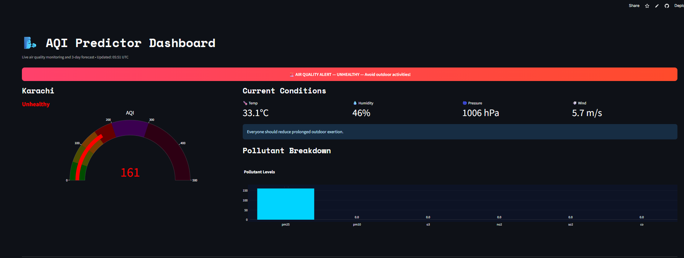
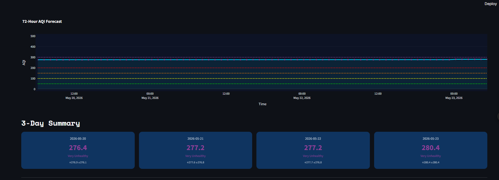
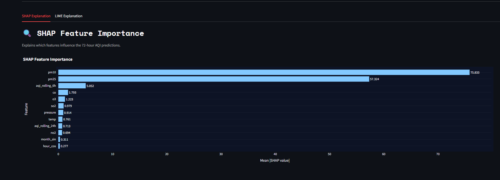
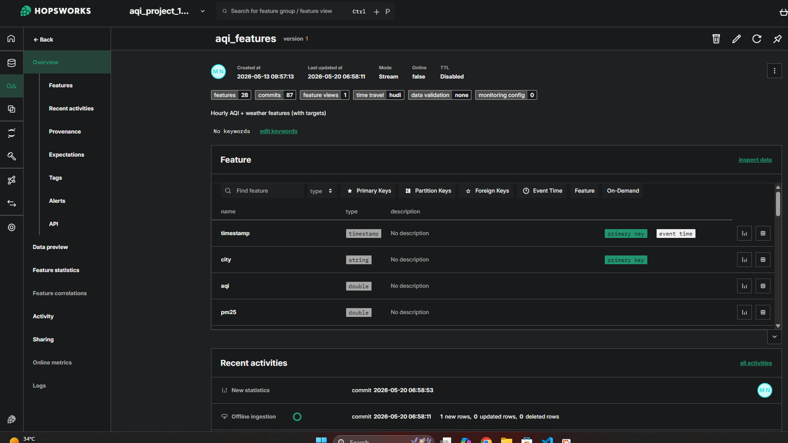

# Pearls AQI Predictor - Karachi

Project collects AQI, pollutant, and weather data, creates machine learning features and stores them in Hopsworks Feature Store,it trains AQI prediction models, registers the best model in Hopsworks Model Registry, and displays real-time AQI insights with a 72-hour forecast on a Streamlit dashboard.

---
## Live Dashboard

Streamlit Dashboard:

- [Live Streamlit Dashboard](https://pearls-aqi-predictor-5zku3wspc4pufnzbptlxqz.streamlit.app/)

GitHub Repository:

GitHub Repository: [Open GitHub Repository](https://github.com/maham03nad/pearls-aqi-predictor)

---

## City

Karachi, Pakistan
Latitude: `24.8607`  
Longitude: `67.0011`

---

## Project Objective

The main objective of this project is to predict the AQI for the next 72 hours using a serverless machine learning pipeline.

The system includes:

- AQI and pollutant data collection
- Weather data collection
- Feature engineering
- Historical backfill
- Hopsworks Feature Store
- Model training and evaluation
- Hopsworks Model Registry
- GitHub Actions automation
- Streamlit dashboard
- SHAP feature importance
- AQI health alerts

---

## Data Sources

### AQICN

AQICN was used to collect AQI and pollutant values:

- AQI
- PM2.5
- PM10
- O3
- NO2
- SO2
- CO

### OpenWeather / Weather Data

Weather data was used because weather conditions affect pollution concentration and movement.

Weather features include:

- Temperature
- Humidity
- Pressure
- Wind speed
- Wind direction

Both AQICN and OpenWeather were used because AQI depends on both pollutant levels and weather conditions.

---

## System Architecture

```text
AQICN + OpenWeather APIs
        ↓
Feature Pipeline
        ↓
Feature Engineering
        ↓
Hopsworks Feature Store
        ↓
Training Pipeline
        ↓
Hopsworks Model Registry
        ↓
Streamlit Dashboard
        ↓
AQI Forecast + SHAP + Alerts
```
---

## Feature Pipeline

The feature pipeline fetches live AQI, pollutant, and weather data for Karachi.

It collects:

- AQI
- PM2.5
- PM10
- O3
- NO2
- SO2
- CO
- Temperature
- Humidity
- Pressure
- Wind speed
- Wind direction

Then creates engineered features:

- Hour
- Day of week
- Month
- Weekend flag
- Hour sine/cosine
- Month sine/cosine
- AQI change rate
- AQI rolling average over 6 hours
- AQI rolling average over 24 hours
- Future AQI targets for 3h, 24h, and 72h

The processed data is stored in Hopsworks Feature Store.

Feature group:
```text
aqi_features
```
The feature group contains 28 engineered features.

---

## Historical Backfill

A historical backfill pipeline was created to generate training data from past AQI and weather records.

The backfill pipeline:

- Fetches historical AQI and pollutant data
- Fetches historical weather data
- Computes engineered features
- Creates future AQI targets
- Stores the processed data in Hopsworks Feature Store

This created enough historical data for model training.

---

## Feature Engineering

These following features were created for AQI prediction:

### Pollutant Features

- PM2.5
- PM10
- O3
- NO2
- SO2
- CO

### Weather Features

- Temperature
- Humidity
- Pressure
- Wind speed
- Wind direction

### Time-Based Features

- Hour
- Day of week
- Month
- Weekend flag
- Hour sine/cosine
- Month sine/cosine

### Derived Features

- AQI change rate
- AQI rolling average over 6 hours
- AQI rolling average over 24 hours

### Target Features

- target_aqi_3h
- target_aqi_24h
- target_aqi_72h

The main dashboard forecast uses `target_aqi_72h`.

---

## Hopsworks Feature Store

It is used to store the engineered features.

Feature Store status:
```text
Feature Group: aqi_features
Version: 1
Features: 28
Data Preview: Available
Materialization Jobs: Successful
```
The Feature Store contains AQI, pollutant, weather, time-based, rolling, and target columns.
---

## Exploratory Data Analysis

EDA was performed in:

```text
eda.ipynb
```

The EDA used the Hopsworks `aqi_features` dataset.

The EDA included:

- Missing value analysis
- AQI summary statistics
- AQI distribution
- AQI trend over time
- Average AQI by hour
- Average AQI by month
- Pollutant vs AQI scatter plots
- Feature correlation heatmap
- Model comparison

## EDA Findings

- The dataset contains 8,589 rows and 28 engineered features.
- After removing rows with missing future target values, 8,543 clean records remained.
- Missing values were mainly present in future target columns, which is expected because the last records do not have future AQI values.
- AQI values vary over time, which makes forecasting meaningful.
- Pollutants such as PM2.5, PM10, O3, NO2, SO2, and CO were analyzed against AQI.
- Weather features such as temperature, humidity, pressure, wind speed, and wind direction were included because weather affects pollution concentration and movement.
- Correlation analysis showed relationships between pollutant features, rolling AQI values, and AQI.
- SHAP feature importance was used in the dashboard to explain which features influence predictions.
---

## Model Training and Evaluation

Multiple regression models were trained and compared:

- Linear Regression
- Ridge Regression
- Random Forest Regressor
- Gradient Boosting Regressor

AQI prediction is a regression problem, so the models were evaluated using:

- MAE
- RMSE
- R² Score

Accuracy was not used because AQI prediction is a regression problem, not a classification problem.

### Model Comparison Note

Random Forest performed best on the random train-test split in the notebook.

But in the training pipeline Gradient Boosting is selected as a final registered model based on the pipeline evaluation metrics in Hopsworks Model Registry.

Therefore, Gradient Boosting was used as the final production model, while Random Forest was kept as part of the model comparison experiment.

---

## Final Registered Model

The final model was stored in Hopsworks Model Registry.

```text
Model Name: aqi_predictor
Latest Version: 2
Best Model: GradientBoost
Framework: Python
```

Model metrics:

```text
MAE: 11.76
RMSE: 19.97
R²: 0.738
```
---

## SHAP Feature Importance

SHAP was used for model explainability.

The Streamlit dashboard shows SHAP feature importance to explain which features influence the AQI predictions.

Important features included:

- PM10
- PM2.5
- AQI rolling average
- CO
- O3
- NO2
---

## AQI Alerts

The dashboard includes AQI health alerts.

Alert categories:

- Good
- Moderate
- Unhealthy for Sensitive Groups
- Unhealthy
- Very Unhealthy
- Hazardous

When AQI reaches unhealthy or hazardous levels, the dashboard displays a warning message.

---

## Automation with GitHub Actions

GitHub Actions was used to automate the project pipelines.

Workflows:

```text
Feature Pipeline: Runs every hour
Training Pipeline: Runs daily
Backfill Pipeline: Runs manually when needed
```
Workflow files:

```text
.github/workflows/feature.yml
.github/workflows/training.yml
.github/workflows/backfill.yml
```
The GitHub Actions runs show green checks for both hourly feature pipeline and daily training pipeline.

---

## Streamlit Dashboard

The dashboard displays:

- Current AQI
- AQI category
- AQI gauge
- Current weather conditions
- Pollutant breakdown
- 72-hour AQI forecast
- 3-day forecast summary
- SHAP feature importance
- AQI scale reference
- AQI health alerts

---

## Technologies Used

- Python
- Pandas
- NumPy
- Scikit-learn
- Hopsworks Feature Store
- Hopsworks Model Registry
- GitHub Actions
- Streamlit
- Plotly
- SHAP
- AQICN API
- OpenWeather API

---

## Deployment

The Streamlit dashboard is deployed on Streamlit Cloud.

Dashboard Link:  

https://pearls-aqi-predictor-vanjmdtr4gorcqmmpmpdhf.streamlit.app/

The feature pipeline and training pipeline are automated using GitHub Actions.

---

## Project Files

```text
feature_pipeline.py      Hourly feature pipeline
backfill.py              Historical data backfill
training_pipeline.py     Model training pipeline
eda.ipynb                EDA and model comparison notebook
streamlit.app/app.py     Streamlit dashboard
models/                  Saved models and SHAP image
.github/workflows/       GitHub Actions workflows
```
---

## Screenshots

### Streamlit Dashboard


### 72-Hour AQI Forecast


### SHAP Feature Importance


### Hopsworks Feature Store


---

## Final Submission Summary

This project includes:

- AQI and weather data collection
- Hopsworks Feature Store integration
- Historical backfill
- EDA notebook
- Model training and evaluation
- Hopsworks Model Registry
- GitHub Actions automation
- Streamlit dashboard
- 72-hour AQI forecast
- SHAP feature importance
- AQI health alerts

---
